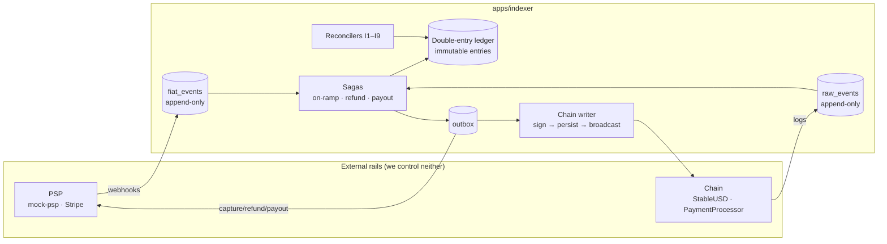

<div align="center">

# 💵⇄🪙 Ledgerline

**A fiat ⇄ stablecoin payment rail with a real double-entry ledger.**

Two append-only logs — one off-chain, one on-chain — feed one balanced ledger. Sagas with real
compensation, a crash-safe chain write path, reconciliation invariants that page, and a fault
injection harness that proves the failure handling instead of asserting it.

<!-- Replace OWNER/REPO with your GitHub path once pushed. -->

[](https://github.com/OWNER/REPO/actions/workflows/ci.yml)
[](LICENSE)


</div>

> **Status:** 🏗️ Part 1 (the ledger) in progress — Phase 0 done, the database-enforced double-entry
> ledger built and tested; contracts, chain writer, fiat rail and sagas are designed but not yet
> built. [`docs/progress.md`](docs/progress.md) is the source of truth for what exists. Built
> block-by-block per [`docs/build-plan.md`](docs/build-plan.md); each block ends in a working,
> committable state. **Much of what this README describes is the design; read it with that in mind.**

---

## Why this exists

Moving a stablecoin is close to solved. **Getting fiat in and out is not**, and the reason is
structural: a payment rail has _two independent sources of truth_ — the payment processor and the
chain — and it controls neither of them. Neither can be rolled back by the other. Both retry, both
deliver out of order, and both can tell you something is final when it is not.

Everything interesting in this repo falls out of that one fact:

| The problem                 | What it forces                                                                      |
| --------------------------- | ----------------------------------------------------------------------------------- |
| Two logs that must agree    | Reconciliation invariants, and a drift metric that means something                  |
| Neither system supports 2PC | Sagas with real compensation, ordered so the recoverable failure is last            |
| Both rails retry            | Idempotency at four layers, from the HTTP request down to a contract revert         |
| Some steps cannot be undone | An explicit irreversibility map, and compensations that are debt entries and humans |
| "Confirmed" ≠ "final"       | Confirmation depth as a **risk budget**, and reorgs that self-heal                  |

## Architecture



See [`docs/architecture.md`](docs/architecture.md) for the full design, or
[`docs/ARCHITECTURE-WALKTHROUGH.md`](docs/ARCHITECTURE-WALKTHROUGH.md) for the same thing taught from
zero, step by step, with review checkpoints for anyone reading the code for bugs.

## Design highlights

- **Two append-only logs, one discipline.** The webhook endpoint does exactly three things: verify
  the HMAC, `INSERT ... ON CONFLICT DO NOTHING`, return 200. No business logic in the request. That
  is what turns duplicate, out-of-order and too-early webhooks into non-events.
- **A double-entry ledger the database enforces.** A deferred constraint trigger asserts
  `Σ debits = Σ credits` **per asset** at COMMIT; entries are immutable and corrections are reversing
  transactions. The trial balance is a live gauge that must read exactly `0`.
- **Reserve coverage as the headline metric.** `bank_settlement + psp_receivable ≥ totalSupply()` —
  what an issuer's ops team actually watches, and what dips visibly when you inject a fault.
- **Sagas advance on confirmed events, never receipts.** Crediting on a receipt is the classic
  exchange-deposit loss vector. The one exception is a revert, which only ever drives _compensation_.
- **A chain write path that is crash-safe by construction.** The signed transaction commits _before_
  it is broadcast, so recovery is always "re-broadcast every unconfirmed attempt" — and
  `already known` / `nonce too low` are success signals.
- **Compensations ordered so the recoverable failure is last.** Refund the token before the card;
  burn before you pay fiat. The failure mode becomes an SLA problem instead of a solvency problem.
- **Idempotency in depth, ending on-chain.** `settle` reverts `PaymentAlreadySettled`, so a
  crashed-and-restarted submitter _cannot_ double-pay a merchant even if every off-chain guard fails.
- **Fault injection as a first-class feature.** The mock PSP can be told to duplicate, reorder, delay,
  drop, or mis-amount any webhook. Every entry in the failure matrix names the test that will use it
  (the mock PSP and its fault API are Part 5, not yet built).

## The failure matrix

[`docs/failure-modes.md`](docs/failure-modes.md) enumerates 57 failure modes across the fiat rail,
the chain write path, the ledger and the cross-cutting layer — each with its trigger, detection,
designed response, and the test that proves it (for the ledger entries, already written; for the
rest, the test is the spec for a part still to build). A sample of what is designed for:

> Card captured but the chain transaction reverts · webhook arriving before our own commit · refund
> event before the capture event · chargeback after we already paid out · ACH return three days later
> · reorg after a merchant was credited · reorg _deeper_ than confirmation depth after an irreversible
> payout · a recipient blacklisted mid-flight · treasury out of gas · treasury out of float · a nonce
> hole · a stuck transaction at the fee ceiling · an RPC that lies about a receipt · Anvil wiped while
> Postgres survived · duplicate idempotency key with a _different_ body · a PSP that captured a
> different amount than we quoted.

## Decisions

Every significant choice has an ADR in [`docs/decisions/`](docs/decisions/) recording the
alternatives considered and **why each one lost** — money representation, the outbox, nonce
allocation, on-chain versus off-chain, key management, and the rest.

## Following along

| Document                                                               | Answers                                                   |
| ---------------------------------------------------------------------- | --------------------------------------------------------- |
| [`docs/ARCHITECTURE-WALKTHROUGH.md`](docs/ARCHITECTURE-WALKTHROUGH.md) | **Start here** — the whole system explained from zero     |
| [`docs/progress.md`](docs/progress.md)                                 | **What's done so far** — the tracker                      |
| [`docs/implementation-guide.md`](docs/implementation-guide.md)         | What to build next, in which file, and what depends on it |
| [`docs/learning-path.md`](docs/learning-path.md)                       | Why each piece exists — the concepts, block by block      |
| [`docs/build-plan.md`](docs/build-plan.md)                             | The phases, exit criteria, and what gets cut first        |

## Repo layout

| Path                 | What                                                                                           |
| -------------------- | ---------------------------------------------------------------------------------------------- |
| `apps/indexer`       | NestJS — both ingest paths, ledger, sagas, chain writer, compliance, API                       |
| `apps/mock-psp`      | Fake payment provider with a fault-injection API                                               |
| `apps/web`           | Next.js demo UI (checkout, merchant balance, lag badge)                                        |
| `packages/contracts` | Foundry — `StableUSD` + `PaymentProcessor` (interface stubs until Part 2)                      |
| `packages/shared`    | ABIs, shared types, deployed addresses                                                         |
| `infra`              | docker-compose + Prometheus/Grafana/OTel/Jaeger/Alertmanager + loadgen                         |
| `docs`               | architecture · failure-modes · decisions/ · conventions · observability · runbook · build-plan |

## Quickstart

```bash
# Prerequisites: Node 22, pnpm 10, Docker, Foundry
pnpm install
cp .env.example .env

make demo     # Anvil, Postgres, indexer, mock-psp, web, Grafana, Jaeger, loadgen
```

Once the build phases land, `make demo` brings the full stack up in ~2 minutes: a payment completing
end to end, the **Money Truth** dashboard showing reserve coverage at `1.000`, and a single Jaeger
trace spanning _fiat → chain → settlement_.

## Non-goals, stated plainly

Real funds. Mainnet. Mempool tracking. Multi-instance ingest scaling. Price oracles. **A peg or
collateral mechanism** — this is a payment rail _on top of_ a stablecoin, not an attempt to design
one.

### On compliance

> This is not a licensed money transmitter, VASP, or e-money institution, and nothing here
> constitutes a compliance program. The screening layer exists to demonstrate _where_ screening
> belongs in a payment saga and _what its failure modes are_. It uses a pinned public-domain OFAC SDN
> snapshot and a deterministic mock analytics adapter. There is no real KYC vendor, no real customer
> PII, no real sanctions determination, and no audit trail any regulator would accept. What **is**
> real: the gate placement, the fail-closed policy, the immutable versioned `screening_checks` audit,
> and the on-chain blacklist integration.

### On custody

The demo signs with well-known public Anvil test keys, and no amount of architecture changes that.
What is designed to be built — Part 3, not yet started — is the part that transfers: a `SignerPort`
with a policy service enforcing per-key value caps, `to` allowlists, **function-selector
allowlists**, chain-id pinning and a kill switch, plus a full `signing_requests` audit trail; and a
KMS adapter unit-tested against fixtures — the low-`s` normalization and `v` recovery that everyone
gets wrong — and deliberately never run in the demo. See [ADR-0011](docs/decisions/0011-key-management.md).

## Development

See [`CLAUDE.md`](CLAUDE.md) for project rules and [`docs/conventions.md`](docs/conventions.md) for
the coding conventions (binding). Commits follow
[Conventional Commits](https://www.conventionalcommits.org/).

## License

[MIT](LICENSE)
