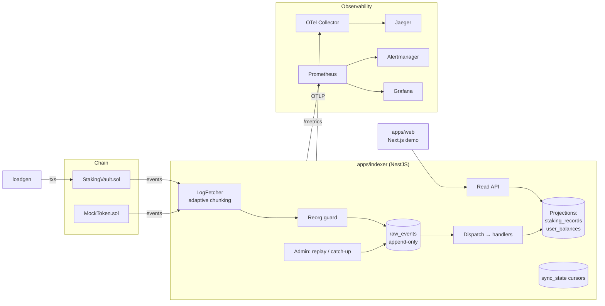

<div align="center">

# ⛓️ ChainStake

**A production-grade, event-sourced blockchain staking indexer.**

All staking state is _derived_ from smart-contract events — with idempotent ingestion, reorg
handling, crash recovery, replayable projections, and a full observability stack
(Prometheus · Grafana · OpenTelemetry · Jaeger).

</div>

> **Status:** 🏗️ Skeleton. This repo is scaffolded phase-by-phase per
> [`docs/build-plan.md`](docs/build-plan.md). Each phase ends in a working, committable state.

---

## Why this exists

ChainStake is not a CRUD app. It is a self-hosted **event-sourced indexer** that treats the chain as
the single source of truth and the database as a rebuildable projection. It demonstrates
distributed-systems thinking (idempotency, event sourcing, reorg handling, crash recovery),
real SRE/observability skills, and blockchain depth (Solidity, Foundry, viem) in one coherent,
one-command-runnable system.

## Architecture



See [`docs/architecture.md`](docs/architecture.md) for the full design.

## Repo layout

| Path                 | What                                                                       |
| -------------------- | -------------------------------------------------------------------------- |
| `apps/indexer`       | NestJS — indexing engine + read API + admin (replay/catch-up)              |
| `apps/web`           | Next.js demo UI (wallet connect, stake/withdraw, live balance + lag badge) |
| `packages/contracts` | Foundry — `StakingVault` + `MockToken`, tests, deploy script               |
| `packages/shared`    | ABIs, shared types, deployed addresses                                     |
| `infra`              | docker-compose + Prometheus/Grafana/OTel/Jaeger/Alertmanager + loadgen     |
| `docs`               | conventions · architecture · observability · runbook · build-plan          |

## Quickstart

```bash
# Prerequisites: Node 22, pnpm 10, Docker, Foundry
pnpm install
cp .env.example .env

# One-command demo (Anvil, Postgres, indexer, web, Grafana, Jaeger, loadgen, …)
make demo
```

Once the build phases land, the demo brings up the full stack in ~2 minutes:
UI live · Grafana graphs moving · Jaeger traces flowing.

## Design highlights

- **Idempotent ingestion** — `UNIQUE(chain_id, tx_hash, log_index)` + `ON CONFLICT DO NOTHING`.
- **Single parameterized indexing loop** — backfill = live = catch-up.
- **Crash-safe cursors** — cursor advance and inserts commit in one transaction.
- **Reorg handling** — confirmation depth + hash continuity + orphan/rewind/replay.
- **Adaptive chunking + RPC failover** — halve-on-error, multiplicative recovery, `fallback([...])`.
- **Replayable projections** — rebuild all derived state from `raw_events` in minutes, no RPC.
- **Reconciliation audit** — on-chain `totalStaked()` vs indexed sum → `reconciliation_drift` metric.

## Non-goals

Mainnet deployment, real funds, mempool tracking, multi-instance ingest scaling, token price feeds.

## Development

See [`CLAUDE.md`](CLAUDE.md) for project rules and
[`docs/conventions.md`](docs/conventions.md) for the coding conventions (binding: clean, readable,
standard-following code is required). Commits follow
[Conventional Commits](https://www.conventionalcommits.org/).

## License

[MIT](LICENSE)
