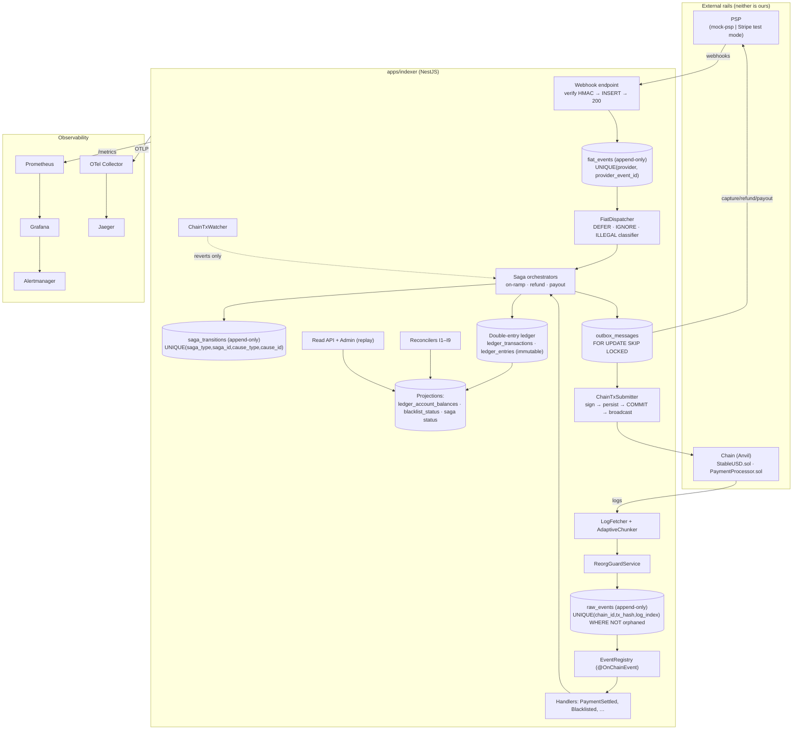

# Ledgerline — Architecture

> Two append-only logs — one off-chain, one on-chain — feed one double-entry ledger. Every balance
> is a projection. Every state machine advances only on a durably-recorded fact. Every irreversible
> action is guarded by a reservation.

Ledgerline is a **bidirectional fiat ⇄ stablecoin payment rail**. Customers pay fiat; merchants are
settled in a stablecoin we issue; merchants can cash out back to fiat. The interesting engineering is
not the token transfer — that part is close to solved. It is that **two independent sources of truth
must agree, and we control neither of them.**

---

## 1. System overview



---

## 2. Core design decisions

Each has a full ADR in [`decisions/`](decisions/) recording the alternatives considered and why they
lost. The summaries below are the shape; the ADRs are the argument.

### 2.1 Two logs, one discipline ([ADR-0002](decisions/0002-fiat-events-log.md))

`raw_events` (on-chain) and `fiat_events` (off-chain) are both append-only, both deduped by a
provider-supplied identity, both processed by a separate worker rather than inline.

The webhook endpoint does exactly three things: **verify the HMAC over the raw body, `INSERT ... ON
CONFLICT DO NOTHING`, return 200.** No business logic in the HTTP request. This is what turns
duplicate, out-of-order and too-early webhooks from incidents into non-events.

### 2.2 Double-entry ledger, enforced by the database ([ADR-0004](decisions/0004-double-entry-ledger.md))

`ledger_entries` are immutable debit/credit pairs. Three enforcement layers, all in Postgres:

1. **Immutability** — a trigger raises on `UPDATE`/`DELETE`; `UPDATE`/`DELETE` are revoked from the
   app role. Corrections are _reversing transactions_ (`reverses_id`), never edits.
2. **Balance** — a `CONSTRAINT TRIGGER ... DEFERRABLE INITIALLY DEFERRED` fires at COMMIT and asserts
   `SUM(debit) = SUM(credit)` **grouped by `asset_code`**. Deferred is essential: entries arrive one
   INSERT at a time and are only balanced at the end.
3. **Non-negative** — the same trigger rejects any account with `allows_negative = false` that ended
   the transaction below zero.

Balances are a projection (`ledger_account_balances`), rebuildable from the entries. The trial
balance is both an invariant test and a live metric.

> A ledger whose balances merely _should_ balance is worse than no ledger, because it makes a claim
> it does not back. The deferred constraint trigger is the non-negotiable part of this design.

### 2.3 Money is an integer minor unit of a named asset ([ADR-0001](decisions/0001-money-representation.md))

`numeric(38,0)` in Postgres, `string` in TypeScript, `bigint` only inside arithmetic helpers.
Arithmetic may only combine amounts of the same `asset_code`.

Cross-asset movement is **never** a subtraction — it is two balanced transactions joined by an **FX
clearing pair** (`1800 fx_clearing:USD` / `1810 fx_clearing:USDX`). A single `convert()` helper
returns `{ amount, residual }` and the residual is **journaled to `3900 rounding_residual`, never
dropped**. This is what keeps the trial balance at exactly zero forever.

### 2.4 Typed saga aggregates over a shared transition log ([ADR-0003](decisions/0003-saga-tables.md))

`payment_intents`, `refunds` and `payouts` are concrete typed tables. Every state change appends to
`saga_transitions` with `UNIQUE(saga_type, saga_id, cause_type, cause_id)`.

That unique key is the entire orchestration idempotency story: **applying the same cause twice is a
no-op at the database level, not the application level.**

A transition whose `from_status` doesn't match current state is neither an error nor silently
ignored. It is classified:

| Classification | Meaning                                           | Response              |
| -------------- | ------------------------------------------------- | --------------------- |
| `IGNORE`       | Already past this point — an idempotent duplicate | No-op, count it       |
| `DEFER`        | Arrived too early; legal later                    | Re-queue with backoff |
| `ILLEGAL`      | Cannot ever be legal from here                    | Dead-letter + page    |

This tri-state classification is the out-of-order defence.

### 2.5 Sagas advance on confirmed events, never on receipts ([ADR-0007](decisions/0007-events-not-receipts.md))

The submitter writes to the chain; the **indexer** observes the result and moves the saga. A receipt
is a hint, not a fact.

The single exception: `receipt.status = 0` (a revert) _does_ drive a saga — a revert emits no events,
so the event path can never learn about it. And it only ever drives the saga **toward compensation,
never toward crediting**.

`confirmations_required` is **per-kind risk policy, not a constant**: `settle = 2` on Anvil / `12`
real; `payout_burn = 2 × settle`, because a payout triggers an irreversible fiat transfer.

### 2.6 The chain write path signs and persists _before_ broadcasting ([ADR-0006](decisions/0006-chain-write-path.md))

This is entirely new — the inherited indexer design was read-only.

```
BEGIN
  SELECT … FROM chain_accounts … FOR UPDATE      -- serializes nonce allocation
  nonce := next_nonce;  UPDATE next_nonce = nonce + 1
  INSERT INTO chain_transactions (…, intent_key) ON CONFLICT (intent_key) DO NOTHING
  policy check + sign
  INSERT INTO chain_tx_attempts (raw_tx, tx_hash, broadcast_at = NULL)
COMMIT
-- only now:
eth_sendRawTransaction(raw_tx)
```

A signed raw transaction is **deterministic bytes with a fixed hash**. After a crash at any point,
recovery is simply "re-broadcast every attempt whose parent isn't confirmed." Re-broadcasting an
already-mined transaction returns `already known` / `nonce too low` — **success signals, not
errors.** Idempotency comes free from the EVM.

Gas escalation, and the rule that matters: **only ever escalate `MIN(nonce)` for an account.**
Bumping a later transaction to fix a nonce hole is useless (it cannot be mined) and burns fees.

### 2.7 Compensation ordering: the recoverable failure goes last ([ADR-0008](decisions/0008-compensation-ordering.md))

- **Refund** — claw the token back **first**, then refund the card. Chain-first failure means a
  delayed customer refund (an SLA problem). Fiat-first failure means the customer is paid _and_ the
  merchant keeps the tokens (a solvency problem with no recovery path).
- **Payout** — burn **first**, then pay fiat. Fiat-first plus a failed burn leaves the merchant
  holding both.
- **Batching** is inserted _after_ `burn_confirmed`, never before. Burns stay per-payout and
  fine-grained; only the bank-file submission batches.

> A saga's compensation is not "undo." It is "the best available economically equivalent action" —
> and sometimes that action is a debt entry and a human.

### 2.8 On-chain only what must survive a compromised server ([ADR-0009](decisions/0009-on-chain-vs-off-chain.md))

Two on-chain invariants are load-bearing for the whole system:

- `settle` reverts `PaymentAlreadySettled` if the payment id exists → **a duplicate submission from a
  crashed-and-restarted submitter can never double-pay a merchant.** Off-chain idempotency is
  defence-in-depth on top of this, not the primary mechanism.
- `refunded + amount <= captured` → **partial-refund overrun is impossible even if every off-chain
  check is wrong.**

Everything else — orchestration, retries, batching, fee policy, FX, and **all PII, always** — stays
off-chain.

### 2.9 Reorg guard, failure isolation, replay (inherited, extended)

Confirmation depth + parent-hash continuity. On divergence: orphan the affected `raw_events`, rewind
the cursor, replay. Because projections are derived, recovery is mechanical — but a payment system
adds a second step: the orphaning handler appends a **compensating transition** and posts a
**reversing ledger transaction**. It never deletes.

`ReplayService` rebuilds **projections only** (`ledger_account_balances`, saga `status`,
`blacklist_status`) from the append-only logs, with no RPC. It runs in a transaction where
`UPDATE`/`DELETE` are revoked on the log tables, so a bug in replay cannot corrupt history.

---

## 3. Data model

### 3.1 The logs and their projections

| Table                     | Role                              | Key                                                          |
| ------------------------- | --------------------------------- | ------------------------------------------------------------ |
| `raw_events`              | Append-only on-chain truth        | `UNIQUE(chain_id, tx_hash, log_index) WHERE NOT is_orphaned` |
| `fiat_events`             | Append-only off-chain truth       | `UNIQUE(provider, provider_event_id)`                        |
| `saga_transitions`        | Append-only orchestration history | `UNIQUE(saga_type, saga_id, cause_type, cause_id)`           |
| `ledger_transactions`     | Balanced posting header           | `UNIQUE(kind, cause_type, cause_id)`                         |
| `ledger_entries`          | **Immutable** debit/credit legs   | `UNIQUE(transaction_id, sequence)`                           |
| `ledger_account_balances` | Projection, rebuildable           | `account_id`                                                 |
| `blacklist_status`        | Projection from issuer events     | `(chain_id, address)`                                        |
| `sync_state`              | Per-key cursors                   | `sync_key`                                                   |
| `indexer_failures`        | Dead letter for failed handlers   | fk → `raw_events`                                            |

> **The `raw_events` uniqueness fix.** The inherited design used a _total_ unique key. On a reorg the
> same transaction is frequently re-included at a different block, and the re-insert was silently
> `DO NOTHING`-ed — leaving a surviving row with a stale, orphaned `block_number`/`block_hash` that
> then poisons confirmation-depth math for a payment. A **partial** unique index lets the orphaned
> copy and the canonical copy coexist. See [ADR-0010](decisions/0010-raw-events-partial-unique.md).

### 3.2 Aggregates, rails and control

| Table                       | Role                                                                  |
| --------------------------- | --------------------------------------------------------------------- |
| `assets`                    | `USD` (fiat, 2dp) · `USDX` (token, 6dp) · `ETH` (native, 18dp)        |
| `merchants`, `customers`    | Counterparties, KYB/KYC status, freeze flags                          |
| `payment_intents`           | On-ramp saga aggregate, with a **frozen pricing snapshot**            |
| `refunds`                   | Refund saga aggregate — N partial refunds, independent lifecycles     |
| `payouts`, `payout_batches` | Off-ramp saga aggregate                                               |
| `outbox_messages`           | One queue, `kind` discriminator, `FOR UPDATE SKIP LOCKED`             |
| `chain_accounts`            | Per-role nonce counter + freeze switch                                |
| `chain_transactions`        | One logical tx: `UNIQUE(intent_key)`, `UNIQUE(chain_id, from, nonce)` |
| `chain_tx_attempts`         | One row per **broadcast**; `raw_tx` persisted before sending          |
| `idempotency_keys`          | `(scope, key)` → `request_hash` + stored response                     |
| `screening_checks`          | Immutable audit, with `list_version` + `list_sha256`                  |
| `limit_counters`            | Velocity controls, row-locked                                         |
| `signing_requests`          | Key-policy audit trail                                                |
| `liquidity_positions`       | Float min/target/max per asset                                        |
| `chain_fingerprint`         | Genesis hash — refuses to boot if the chain was wiped under us        |

**Everything priced is snapshotted on the aggregate at creation and never re-read**:
`destination_address`, `fee_bps_snapshot`, `fx_rate_num`/`den`, `quote_expires_at`. A config change
must never retroactively alter an in-flight payment.

### 3.3 Chart of accounts (seeded by migration)

| Code        | Name                                     | Type      | Asset      |
| ----------- | ---------------------------------------- | --------- | ---------- |
| 1000        | `psp_receivable`                         | asset     | USD        |
| 1010        | `bank_settlement`                        | asset     | USD        |
| 1100        | `token_treasury`                         | asset     | USDX       |
| 1150        | `token_in_transit`                       | asset     | USDX       |
| 1200        | `gas_wallet`                             | asset     | ETH        |
| 1300        | `merchant_receivable` _(per merchant)_   | asset     | USD        |
| 1800 / 1810 | `fx_clearing`                            | equity    | USD / USDX |
| 2000        | `merchant_payable` _(per merchant)_      | liability | USDX       |
| 2010        | `merchant_fiat_payable` _(per merchant)_ | liability | USD        |
| 2100        | `unsettled_capture`                      | liability | USD        |
| 2200        | `frozen_payable` _(per merchant)_        | liability | USDX       |
| 2500        | `stablecoin_issued`                      | liability | USDX       |
| 3900        | `rounding_residual`                      | equity    | per asset  |
| 4000        | `fee_revenue`                            | revenue   | USD        |
| 5000 / 5010 | `psp_fee_expense` / `gas_expense`        | expense   | USD / ETH  |
| 9000        | `chargeback_loss`                        | expense   | USD        |

**Worked example — a $100.00 on-ramp, 1% fee, 1:1 FX.** Four postings, each balanced _within one
asset_:

```
T1  onramp.capture      DR 1000 psp_receivable      USD    10000
                        CR 2100 unsettled_capture   USD    10000

T3  onramp.fx           DR 2100 unsettled_capture   USD    10000
                        CR 4000 fee_revenue         USD      100
                        CR 1800 fx_clearing:USD     USD     9900   ← USD side balances
                        DR 1810 fx_clearing:USDX   USDX 99000000
                        CR 2500 stablecoin_issued  USDX 99000000   ← USDX side balances

T4  onramp.reserve      DR 1150 token_in_transit   USDX 99000000
                        CR 1810 fx_clearing:USDX   USDX 99000000

T5  onramp.settled      DR 2000 merchant_payable   USDX 99000000
                        CR 1150 token_in_transit   USDX 99000000
```

`merchant_payable` is _debited_ at settlement because delivering tokens **discharges** a liability —
the tokens are now in the merchant's own custody. Ledgerline settles **non-custodially**, which is
what makes the irreversibility edge cases real rather than theoretical.

---

## 4. Reconciliation: the invariant set

Our ledger is **never** authoritative about external facts. Its job is to be a complete, balanced,
auditable record of what the chain and the PSP told us, plus our own obligations. Every
reconciliation is therefore _ledger vs external_, never _external vs external_.

| #      | Invariant                                                                       | Cadence                        |
| ------ | ------------------------------------------------------------------------------- | ------------------------------ |
| I1     | Per transaction, per asset: `Σ debits = Σ credits`                              | every write (deferred trigger) |
| I2     | `ledger_account_balances` == recomputed `SUM(ledger_entries)`                   | 5 min + on replay              |
| I3     | `StableUSD.totalSupply()` == balance of `2500 stablecoin_issued`                | 30 s                           |
| I4     | `balanceOf(treasury)` == `token_treasury + token_in_transit`                    | 30 s                           |
| I5     | Σ tokens delivered to merchant M == Σ `merchant_payable:M` discharges           | 5 min                          |
| I6     | `fiat_events`-derived PSP position == PSP-reported balance                      | hourly poll + daily file       |
| **I7** | **Reserve coverage: `bank_settlement + psp_receivable ≥ totalSupply()` at 1:1** | 30 s                           |
| I8     | Every `Transfer` with `from = treasury` has a matching `chain_transactions` row | in-handler                     |
| I9     | `Σ refunds(intent) ≤ captured_amount(intent)`                                   | app + DB + chain               |

**I7 is the headline metric.** It is what a stablecoin issuer's ops team actually watches, and a
single-stat sitting at `1.000` that dips under an injected fault is the most legible thing in the
demo.

**Drift direction carries meaning.** This table is the whole point of having two logs:

| Drift                 | Benign cause                                                | Serious cause                   | Discriminator                                                                      |
| --------------------- | ----------------------------------------------------------- | ------------------------------- | ---------------------------------------------------------------------------------- |
| Chain ahead of ledger | Indexer lag                                                 | **Unauthorized key use**        | I8 — is there a `chain_transactions` row for that outflow? If not, freeze and page |
| Ledger ahead of chain | (should be impossible — pending sits in `token_in_transit`) | Premature credit or handler bug | Run replay. If it resolves, it was a projection bug. If not, it was a real loss    |
| PSP ahead of us       | Dropped webhook                                             | —                               | The poller recovers it; alert only if the recovery _rate_ rises                    |
| We ahead of PSP       | —                                                           | **Forged webhook**              | No benign explanation. Security incident, not a reconciliation incident            |
| Coverage < 1          | Fee timing                                                  | We minted without backing       | Halt minting, page                                                                 |

**Reconciliation runs with zero writes in audit mode.** Auto-healing is a separately-invoked action
with its own ledger transactions and an operator id. _A system that silently self-heals a discrepancy
has destroyed the evidence of the bug._

---

## 5. Request & data flow (on-ramp)

1. **Quote** — `POST /payment-intents` with an `Idempotency-Key`. Screening runs at the `pre_credit`
   gate. Pricing is snapshotted. Nothing has moved yet.
2. **Capture** — an outbox message calls the PSP with the outbox `dedupe_key` as the
   `Idempotency-Key`. The PSP's webhook lands in `fiat_events`. The dispatcher advances the saga and
   posts **T1**.
3. **Reserve** — float is reserved under a row lock (`token_in_transit`), postings **T3**/**T4**. No
   float → the saga _parks_ in `awaiting_liquidity` rather than failing.
4. **Submit** — the submitter simulates, allocates a nonce, signs, persists, commits, broadcasts.
5. **Settle** — the indexer observes `PaymentSettled` at confirmation depth, appends the transition
   and posts **T5**. _Only now is the merchant credited._
6. **Serve** — the read API queries projections only, and reports lag honestly via `/health`.

The reverse flows (refund, payout) are documented as full state machines in
[`build-plan.md`](build-plan.md); every transition, compensation and irreversibility boundary is
enumerated in [`failure-modes.md`](failure-modes.md).

---

## 6. Non-goals

Real funds. Mainnet. A licensed money-transmitter, VASP or e-money entity. Real KYC or real customer
PII. A peg or collateral mechanism — Ledgerline is a **payment rail on top of** a stablecoin, not an
attempt to design one. Multi-instance ingest scaling. Mempool tracking. Price oracles.

**On custody and compliance, specifically:** the screening layer exists to demonstrate _where_
screening belongs in a payment saga and _what its failure modes are_. It uses a pinned public-domain
OFAC SDN snapshot and a deterministic mock analytics adapter. There is no real vendor, no real
sanctions determination, and no audit trail any regulator would accept. What _is_ real: the gate
placement, the fail-closed policy, the immutable versioned `screening_checks` audit, and the on-chain
blacklist integration. See [ADR-0009](decisions/0009-on-chain-vs-off-chain.md) and
[ADR-0011](decisions/0011-key-management.md).

---

See [`build-plan.md`](build-plan.md) for the phased plan, [`failure-modes.md`](failure-modes.md) for
the edge-case matrix, [`observability.md`](observability.md) for the metrics/tracing/logging map, and
[`decisions/`](decisions/) for the ADRs.
