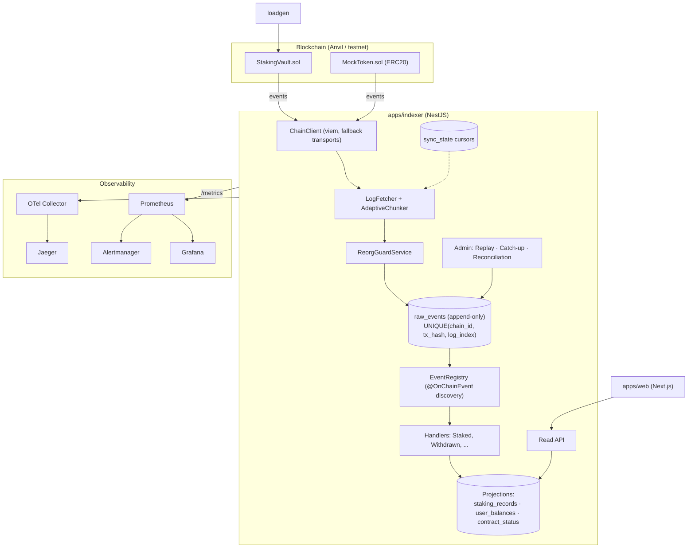

# ChainStake — Architecture

> The chain is the source of truth. The database is a rebuildable projection of on-chain events.

## 1. System overview

## 2. Core design decisions

### 2.1 Single parameterized indexing loop

Backfill, live tailing, and catch-up jobs are the **same** `runChunk(syncKey)` code path,
differentiated only by the `sync_state` row (`kind`, `target_block`). One loop to reason about,
test, and observe.

### 2.2 Idempotent, crash-safe ingestion

- `raw_events` is append-only with `UNIQUE(chain_id, tx_hash, log_index)`; inserts use
  `ON CONFLICT DO NOTHING`.
- Cursor advance and raw-event inserts commit in **one transaction**. A crash mid-chunk is safe to
  restart from the persisted cursor — no gaps, no duplicates.
- Empty ranges still advance the cursor; the loop never reads past `head - CONFIRMATIONS`.

### 2.3 Derived, order-independent projections

Handlers recompute `user_balances` by **aggregation** over `staking_records` rather than mutating a
running total. This makes them order-independent and replay-deterministic, and makes reorg recovery
mechanical.

### 2.4 Handler registry

Handlers declare themselves with `@OnChainEvent({ contract, event })`. At boot, `EventRegistry`
discovers them (Nest `DiscoveryService`) and validates loudly — duplicate handlers or handlers for
unknown events crash startup.

### 2.5 Reorg guard

Confirmation depth + parent-hash continuity check. On divergence: orphan affected `raw_events`,
rewind the cursor, replay the affected range. Because projections are derived, recovery is just a
re-dispatch.

### 2.6 Failure isolation + replay

Per-event `try/catch` marks a `failed` status and dead-letters to `indexer_failures`; a retry job
re-runs a user's events in order with capped attempts. The `ReplayService` can rebuild any projection
from `raw_events` with no RPC — the event-sourcing payoff.

### 2.7 Reconciliation audit

A cron compares on-chain `StakingVault.totalStaked()` with `SUM(user_balances)` and emits
`chainstake_reconciliation_drift_wei`. Non-zero drift is the one metric that proves the DB matches
the chain — it pages on-call.

## 3. Data model (indicative)

| Table              | Role                                     | Key                                    |
| ------------------ | ---------------------------------------- | -------------------------------------- |
| `raw_events`       | Append-only source of truth              | `UNIQUE(chain_id, tx_hash, log_index)` |
| `sync_state`       | Per-key cursors (live/backfill/catchup)  | `sync_key`                             |
| `indexer_failures` | Dead-letter for failed handlers          | `id`, fk → `raw_events`                |
| `staking_records`  | Projection: one row per action           | `UNIQUE(tx_hash, log_index)`           |
| `user_balances`    | Projection: current balance (aggregated) | `user_address`                         |
| `contract_status`  | Projection: paused/owner state           | `contract_address`                     |

## 4. Request & data flow

1. **Ingest:** scheduler tick → `runChunk` → `LogFetcher.getLogs(range)` → reorg check →
   sort by `(block, log_index)` → insert `raw_events` + advance cursor (one tx).
2. **Project:** dispatch each new raw event to its handler → provenance-keyed upsert into
   `staking_records` → aggregate-recompute `user_balances`.
3. **Serve:** the read API queries projections only (never the chain), and reports lag via
   `/health/indexer`.

## 5. Non-goals

Mainnet deployment, real funds, mempool tracking, multi-instance ingest scaling, token price feeds.

---

See [`build-plan.md`](build-plan.md) for the full phased build plan and
[`observability.md`](observability.md) for the metrics/tracing/logging map.
